# Algo Trade Simulator

[](https://github.com/varun-sharma-2006/AlgoTrade/actions/workflows/ci.yml)
[](LICENSE)


A full-stack paper-trading and backtesting platform. Pick a stock, choose a strategy, and see how it would
really have traded over the last two years, fees and slippage included, compared with simply buying and holding
and with the S&P 500. Test whether tuned settings survive out of sample with walk-forward testing, try a
machine-learning strategy that is trained only on the past, and ask the trading copilot to run any of it for you.

**Live demo: [algo-trade-mu.vercel.app](https://algo-trade-mu.vercel.app)** (sign in with Google) ·
**[Watch the 2-minute demo video](docs/demo.mp4)**

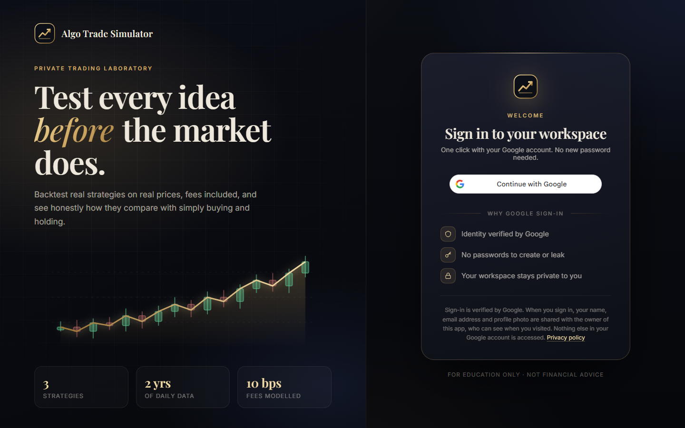

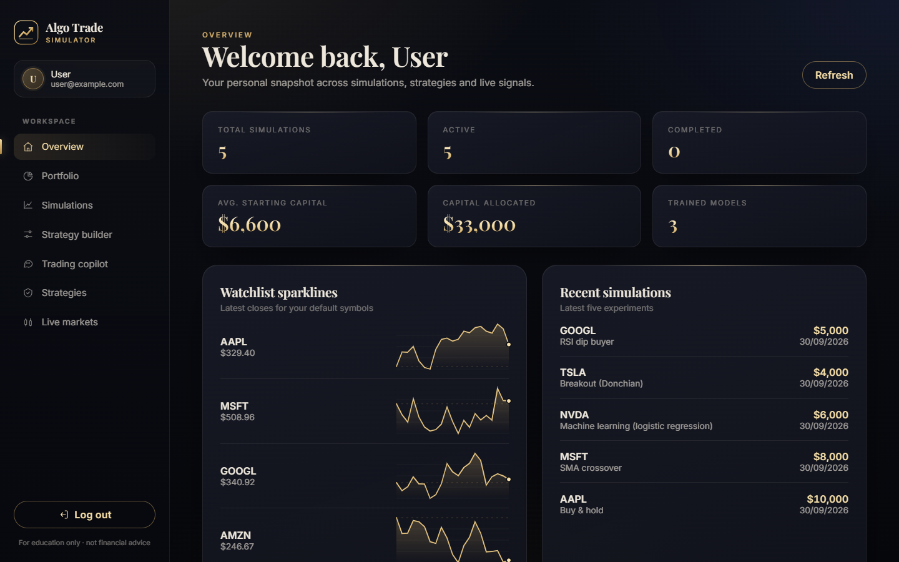

## Features

- **Honest backtesting**: long-only strategies (SMA crossover, Bollinger mean reversion, Donchian breakout and a
  machine-learning model) simulated trade by trade on the last 2 years of daily data, with earlier history used
  only to warm up indicators. Positions are decided at the close using only past data, every entry and exit pays a
  fee (10 bps) plus adjustable slippage (5 bps by default), and results are always shown next to buy & hold.
- **Risk analytics**: total and annualised return, volatility, Sharpe, Sortino, max drawdown and Calmar for the
  strategy, buy & hold and the S&P 500 side by side, plus beta, alpha and correlation to the index, win rate,
  time in market, a growth-of-$1 chart against buy & hold, a drawdown chart and the trade log.
- **Walk-forward testing**: every quarter, each parameter set is backtested on the previous year and the best one
  (by Sharpe) trades the next quarter, which it has never seen, rolling forward over 5 years. It shows how much
  of a backtest's edge was curve fitting: tuned (in-sample) vs out-of-sample returns, fold by fold.
- **Machine-learning strategy**: logistic regression on 8 price features (returns, moving-average gaps, RSI,
  volatility, Bollinger z-score) predicts whether tomorrow closes higher. It is refitted every month on a rolling
  window of past days only, and reports out-of-sample accuracy against an always-up baseline, ROC-AUC, and its
  feature weights. Written from scratch in Python, with no numpy or scikit-learn.
- **Today's signal**: re-runs the trained strategy on the latest data and reports buy / hold / sell / wait with the reason.
- **Trading copilot with actions**: Gemini function calling runs the app's own backtester. "Backtest AAPL with
  SMA 20/60", "Compare strategies on NVDA", "Walk-forward test MSFT with Bollinger" or "Put $5,000 in NVDA with
  the ML strategy from 6 months ago" run for real, and the answer quotes the results, shown as cards in the chat.
  When Gemini is rate-limited, the same requests are recognised without it, and a built-in analyst ranks stocks by
  trend, momentum and RSI, analyses tickers and explains concepts.
- **Live market data**: watchlist quotes, sparklines, ticker search and candlestick charts.
- **Paper-trading portfolio**: invest paper money in any stock with any strategy, backdated up to a year. Each
  simulation is replayed on real daily prices with its strategy's buy/sell rules and fees, so the Portfolio page
  shows live value, profit and loss, today's change, allocation, and how each one did against buy & hold.
- **Strategy Builder**: design your own strategy from rules such as "RSI(14) is below 30" or
  "SMA(50) crosses above SMA(200)", add a stop-loss or take-profit, read it back in plain English, backtest it,
  save it, and use it in simulations.
- **Sign in with Google**: Google verifies each visitor's email; an admin-only **Visitors** page lists who signed in, when and from which device, with CSV export.
- **Runs anywhere**: an in-memory mode needs no database; MongoDB is used for persistence.

| Portfolio | Strategy builder |
| --- | --- |
| 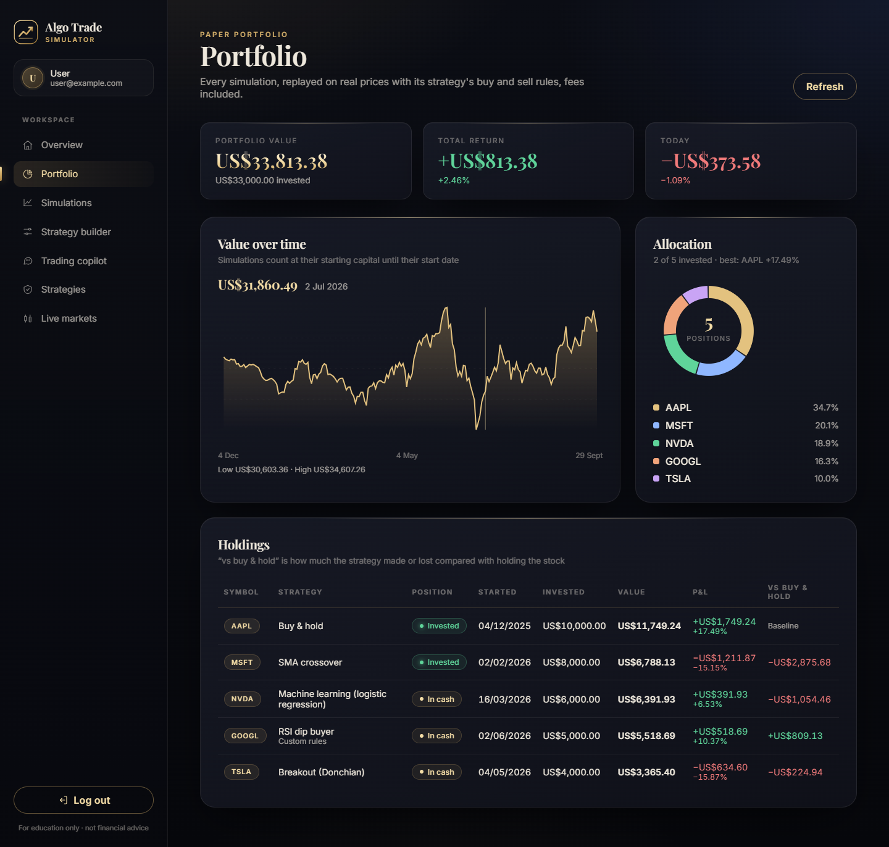 | 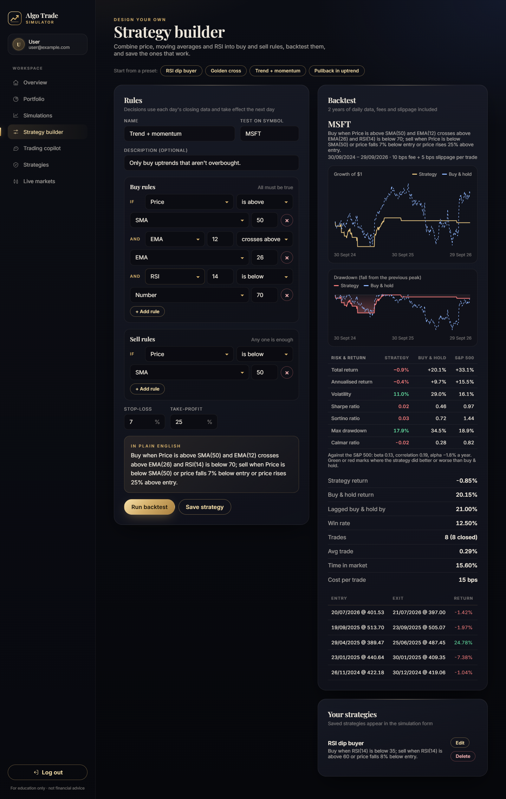 |

| Strategy lab: risk vs buy & hold and the S&P 500 | Machine-learning strategy |
| --- | --- |
| 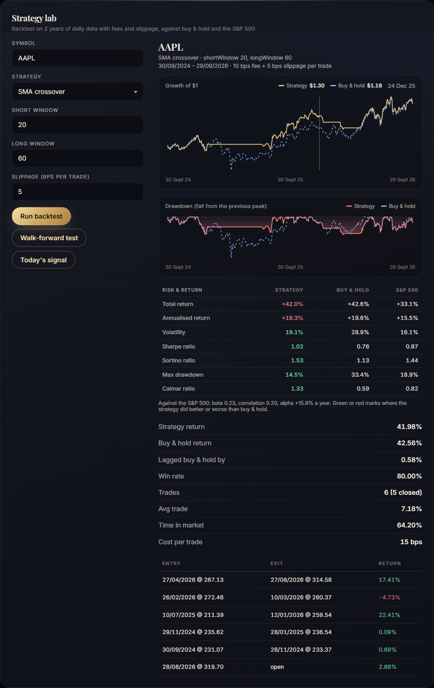 | 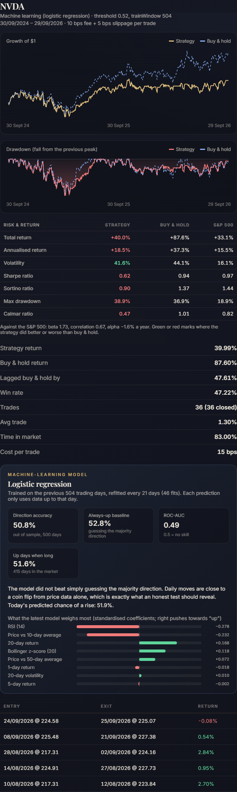 |

| Walk-forward test | Copilot running backtests |
| --- | --- |
| 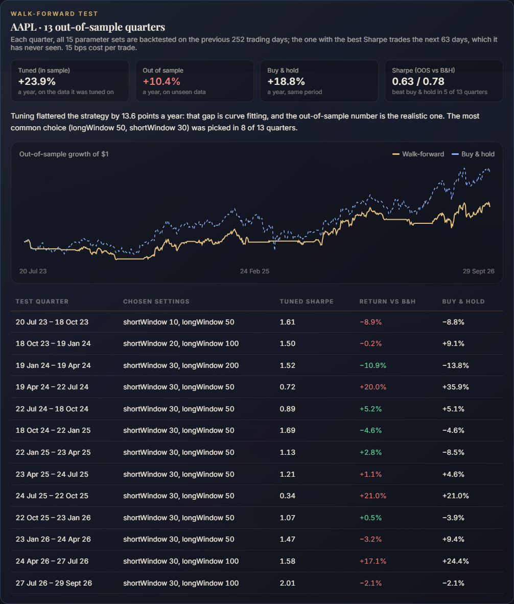 | 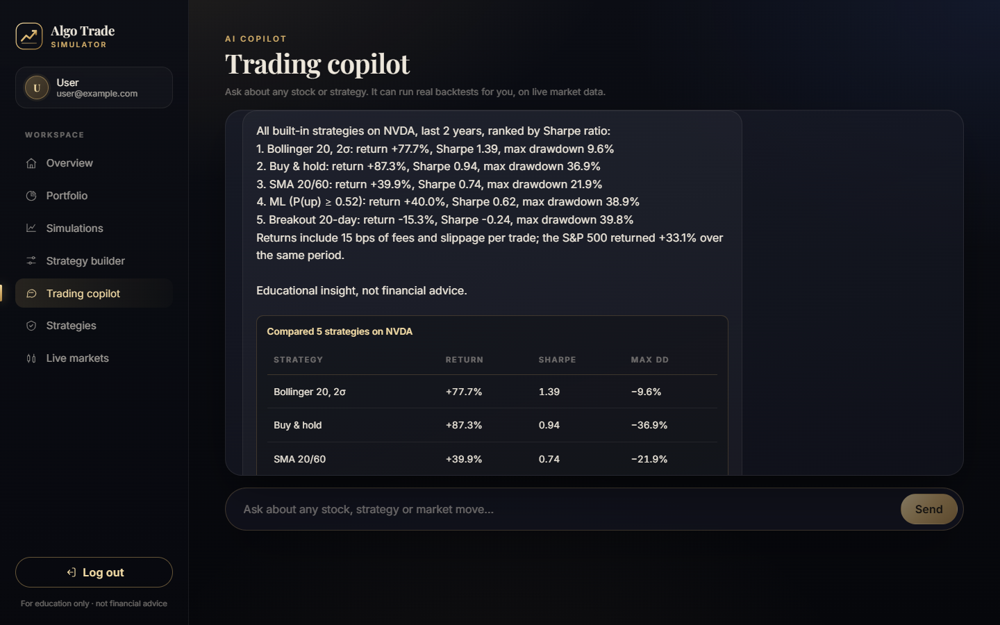 |

| Trading copilot | |
| --- | --- |
| 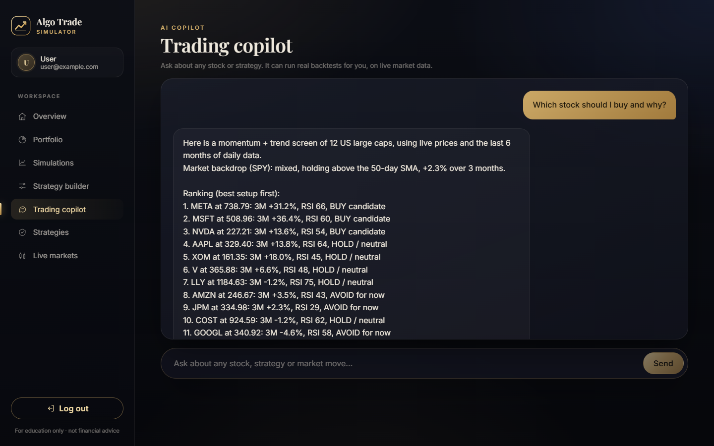 | |

| Live markets | Strategies |
| --- | --- |
| 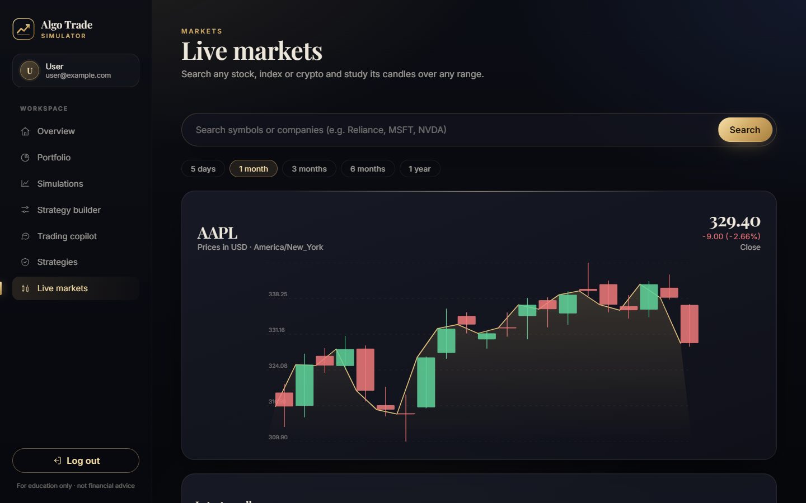 | 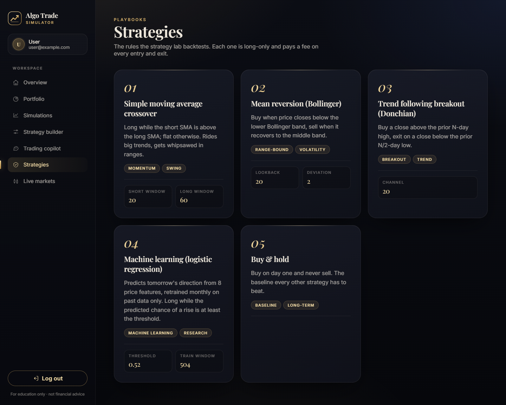 |

## Architecture

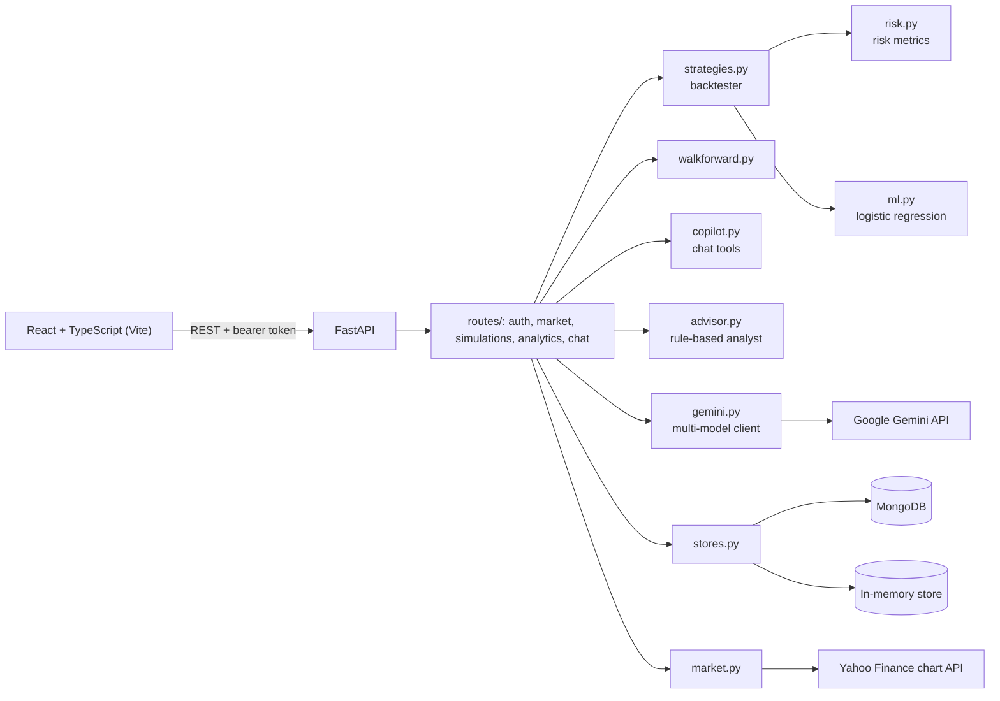

The two stores share one async interface, so routes never branch on which database is active.

```
backend/
  main.py           app factory, lifespan, CORS, router registration
  config.py         environment settings
  schemas.py        request models
  stores.py         MongoStore and InMemoryStore
  market.py         quotes, charts, search (Yahoo Finance JSON API + offline fallbacks)
  strategies.py     strategy signals and the backtester
  risk.py           volatility, Sharpe, Sortino, drawdown, Calmar, beta/alpha vs the S&P 500
  ml.py             machine-learning strategy (logistic regression, time-aware retraining)
  walkforward.py    walk-forward testing (tune on a year, test on the next quarter)
  copilot.py        copilot tools for Gemini function calling, and the offline request parser
  rules.py          Strategy Builder rule engine (SMA, EMA, RSI, crossovers, stop-loss, take-profit)
  portfolio.py      replays simulations on real prices and totals the portfolio
  advisor.py        chatbot analyst used when Gemini is unavailable
  gemini.py         Gemini client with retries and model fallback
  routes/           one router per area
  scripts/          check_setup.py
client/src/
  App.tsx           app shell, auth, data loading
  api.ts            typed API client
  components/       dashboard, strategy lab, charts, chat
  __tests__/        Vitest + Testing Library
```

## Getting started

### Quick start (Windows)

```powershell
powershell -ExecutionPolicy Bypass -File .\start.ps1
```

Installs dependencies on first run, creates `.env` files from the examples (in-memory database and auto-login),
and opens the backend and frontend in their own windows. Then open http://localhost:5173.

### Docker (any OS, with MongoDB)

```bash
docker compose up --build
```

Frontend at http://localhost:8080, API docs at http://localhost:8000/docs. Set `GOOGLE_API_KEY` in your shell
first to enable Gemini answers.

### Manual setup

Prerequisites: Python 3.11+, Node.js 18+, and optionally MongoDB and a Google Gemini API key.

```bash
# Backend
python -m venv backend/.venv
source backend/.venv/bin/activate          # Windows: backend\.venv\Scripts\activate
pip install -r backend/requirements-dev.txt
cp backend/.env.example backend/.env
uvicorn backend.main:app --reload --port 8000

# Frontend (from the repository root, in a second terminal)
npm install
cp client/.env.example client/.env
npm run dev
```

Check your configuration with `python -m backend.scripts.check_setup`.

## Deploying a live demo

**Vercel (free, no card).** [`vercel.json`](vercel.json) builds the React app as static files and runs the API as a
Python serverless function ([`api/index.py`](api/index.py)) under `/api`, all at one URL. Import the repository at
[vercel.com/new](https://vercel.com/new) and deploy; no settings are required. Optionally add `GOOGLE_API_KEY` and, for
data that survives cold starts, a `MONGO_URL` from a free MongoDB Atlas cluster in the project's Environment Variables.

**Hugging Face Spaces (free, no card).** The root [`Dockerfile`](Dockerfile) builds the frontend and serves it from
the API, so the whole app runs in one container at one URL. Create a Space with the **Docker** SDK, then either push
this repo to it (using [`deploy/huggingface/README.md`](deploy/huggingface/README.md) as the Space's README) or let
[`deploy-space.yml`](.github/workflows/deploy-space.yml) do it on every push: add an `HF_TOKEN` secret and an
`HF_SPACE` variable (`user/space-name`) in the GitHub repo settings. Add `GOOGLE_API_KEY` as a Space secret to enable
Gemini.

**Render.** [`render.yaml`](render.yaml) defines the API and the static frontend as two services: choose
**New → Blueprint** and select this repository. Render requires a payment card on file, even for free services.

Both demos use the in-memory store; set `MONGO_URL` (for example MongoDB Atlas) and `USE_IN_MEMORY_DB=false` for
persistence.

## Configuration

Backend variables live in `backend/.env` (see [`backend/.env.example`](backend/.env.example)). Values there
override variables already set in your system environment.

| Variable | Description | Default |
| --- | --- | --- |
| `USE_IN_MEMORY_DB` | Keep data in memory instead of MongoDB (resets on restart) | `false` |
| `MONGO_URL` / `MONGODB_URI` / `MONGO_URI` | MongoDB connection string, first one set wins | `mongodb://localhost:27017` |
| `MONGODB_DB` | Database name | `algo-trade-simulator` |
| `ENABLE_DEV_ENDPOINTS` | Enable `POST /dev/auth/bypass` for automatic dev login | `false` |
| `GOOGLE_CLIENT_ID` | OAuth client ID for Sign in with Google. When set, visitors must sign in with Google, and password sign-up and the dev bypass are turned off | unset |
| `ADMIN_EMAILS` | Comma-separated emails that can open the **Visitors** page (who signed in, when, and on which device) | unset |
| `GOOGLE_API_KEY` | Gemini API key for the chatbot (optional) | unset |
| `GEMINI_MODELS` | Gemini models tried in order | `gemini-3.5-flash,gemini-3.1-flash-lite,gemini-3.5-flash-lite,gemini-flash-latest` |
| `GEMINI_BUDGET_SECONDS` | How long to retry Gemini before the built-in analyst answers | `12` |
| `BACKTEST_PERIOD` | Window backtests report on (e.g. `1y`, `2y`) | `2y` |
| `HISTORY_PERIOD` | Price history fetched (Yahoo Finance range): the backtest window plus warm-up, ML training data and walk-forward folds | `5y` |
| `TRADING_FEE_BPS` | Fee charged on every entry and exit, in basis points | `10` |
| `SLIPPAGE_BPS` | Default slippage per entry and exit, in basis points (the Strategy lab can override it) | `5` |
| `STATIC_DIR` | Serve a built frontend (`dist/`) from the API, for single-container deploys | unset |
| `FRONTEND_ORIGIN` | Allowed CORS origin | `http://localhost:5173` |
| `SESSION_DURATION_DAYS` | Session lifetime | `7` |
| `SESSION_SECRET` | Signs session tokens for the in-memory store (so they work across serverless instances); set a long random value when deployed | a dev-only placeholder |
| `YAHOO_USER_AGENT` | User agent for Yahoo Finance search requests | a generic browser string |

Frontend variables live in `client/.env` (see [`client/.env.example`](client/.env.example)):

| Variable | Description | Default |
| --- | --- | --- |
| `VITE_API_BASE_URL` | API base URL | `http://localhost:8000` |
| `VITE_ENABLE_LOGIN_BYPASS` | Sign in automatically as a dev user | `false` |
| `VITE_LOGIN_BYPASS_EMAIL` / `VITE_LOGIN_BYPASS_NAME` | Identity used by the bypass | backend default |

## API

Interactive docs are served at `/docs`. Authenticated routes expect `Authorization: Bearer <token>`.

| Method | Path | Description |
| --- | --- | --- |
| `POST` | `/auth/signup`, `/auth/login` | Create an account or sign in; returns a token |
| `GET` | `/auth/config` | Which sign-in methods are enabled |
| `POST` | `/auth/google` | Exchange a Google ID token for a session |
| `GET` | `/auth/me` | The signed-in user, including `isAdmin` |
| `GET` | `/admin/visitors` | Admin only: users and recent sign-ins |
| `POST` | `/dev/auth/bypass` | Dev-only automatic sign-in |
| `GET` | `/market/watchlist`, `/market/quote/{symbol}` | Live quotes |
| `GET` | `/market/search?q=`, `/market/chart/{symbol}` | Ticker search and OHLC candles |
| `GET` `POST` | `/simulations` | List or create simulations |
| `PATCH` `DELETE` | `/simulations/{id}` | Update or delete a simulation |
| `GET` | `/analytics/strategies` | Strategy catalogue |
| `POST` | `/analytics/train` | Backtest a strategy: `{symbol, strategyId, ...parameters, slippageBps?}` |
| `POST` | `/analytics/walk-forward` | Walk-forward test: `{symbol, strategyId, slippageBps?}` |
| `POST` | `/analytics/predict` | Today's signal from the last trained strategy |
| `GET` | `/analytics/overview`, `/analytics/sparkline` | Dashboard data |
| `GET` | `/portfolio` | Every simulation valued today, totals, daily history and allocation |
| `GET` `POST` | `/strategies/custom` | List or save Strategy Builder strategies |
| `DELETE` | `/strategies/custom/{id}` | Delete a saved strategy |
| `POST` | `/chat` | Trading copilot; returns `actions` for any backtests or simulations it ran |

Example backtest request:

```json
{ "symbol": "AAPL", "strategyId": "trend-follow", "channel": 20 }
```

Strategy parameters: `sma-crossover` uses `shortWindow` and `longWindow`, `mean-reversion` uses `lookback` and
`deviation`, `trend-follow` uses `channel`, `ml-logistic` uses `threshold` (probability of a rise needed to buy)
and `trainWindow` (days of history each model is fitted on), and `buy-hold` has none. A `custom` strategy sends `rules` instead:

```json
{
  "symbol": "AAPL",
  "strategyId": "custom",
  "rules": {
    "entry": [{ "left": { "kind": "rsi", "period": 14 }, "op": "<", "right": { "kind": "value", "value": 30 } }],
    "exit": [{ "left": { "kind": "rsi", "period": 14 }, "op": ">", "right": { "kind": "value", "value": 60 } }],
    "stopLoss": 0.08
  }
}
```

Operands are `price`, `sma`, `ema`, `rsi` (with a `period`) or a fixed `value`; comparisons are `>`, `<`,
`crosses_above` and `crosses_below`. The strategy buys when **all** entry rules hold and sells when **any** exit
rule holds or the stop-loss / take-profit is hit.

## Testing

```bash
pytest backend              # backend: backtester, risk metrics, ML (including no-look-ahead checks), walk-forward,
                            # copilot tools, analyst, and every API route against both stores
ruff check backend api && ruff format --check backend api
npm test                    # frontend: API client, strategy lab, research panels, copilot cards (Vitest)
npm run check               # TypeScript
```

CI runs all of these on every push and pull request.

## Disclaimer

This project is for education and research. Backtests describe the past and are not a guarantee of future results,
and nothing here is financial advice.

## Team

Built by [Varun Sharma](https://github.com/varun-sharma-2006) and [Yashika Garg](https://github.com/yashikagarg16).

## License

[MIT](LICENSE)
